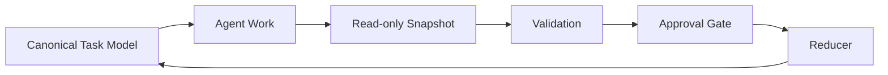

# Agent Work Snapshot

Agent Work Snapshot is a small, read-only checkpoint contract for AI agent work.
It helps coding agents and local automation report status, progress, blockers,
outputs, TTL, and completion candidates without collecting full transcripts.

The initial release is intentionally small: a JSON Schema, a Python validator
CLI, examples, tests, and documentation. It is not a full AI orchestrator.



## Why Snapshots?

Agent conversations and tool logs are useful locally, but they are noisy,
provider-specific, and risky to aggregate. A snapshot contains only the small
work-state report a maintainer needs to review or reconcile progress.

`completed_candidate` is a report, not a command to close a parent task.
Validation, configured approval paths, and the system that owns canonical task
state still decide whether work is complete.

## Quick Start

Agent Work Snapshot requires Python 3.10 or newer.

```bash
git clone https://github.com/manabu619/agent-work-snapshot.git
cd agent-work-snapshot
python -m venv .venv
source .venv/bin/activate
# Windows PowerShell: .venv\Scripts\Activate.ps1
python -m pip install -e .
agent-work-snapshot --version
agent-work-snapshot validate examples/codex.snapshot.json
```

To reject absolute local paths instead of reporting warnings:

```bash
agent-work-snapshot validate --strict-paths examples/codex.snapshot.json
```

## Example

```json
{
  "schema_version": "agent-work-snapshot/v1",
  "snapshot_id": "snap_example_0001",
  "agent_id": "example-coding-agent",
  "parent_task_id": "task_example_0001",
  "observed_at": "2026-01-01T00:00:00Z",
  "source": "local_file",
  "status": "working",
  "progress": {"total": 3, "completed": 1, "blocked": 0},
  "current_focus": "Add validation tests",
  "blockers": [],
  "outputs": ["tests/test_validation.py"],
  "next_checkpoint_at": "2026-01-01T01:00:00Z",
  "ttl_seconds": 3600
}
```

## Validation

The CLI combines two checks:

1. Draft 2020-12 JSON Schema validation with `date-time` format checking.
2. Small policy checks for recursive secret-like keys, relational progress
   constraints, and absolute local paths.

The validator is not a data-loss-prevention (DLP) tool. It cannot reliably
detect secrets or personal information embedded in free text. Run a separate
secret scan and human review before external transmission or publication.

Each finding starts with a stable category such as `[schema]` or
`[progress_relation]`. See [the contract reference](docs/contract.md) for the
category list.

## Schema Notes

- `host_id` is optional. Use only a pseudonymous identifier.
- `schema_version` must be `agent-work-snapshot/v1`.
- `source` is an extensible lowercase identifier such as `local_file`,
  `file_inbox`, `ci_artifact`, or `api_push`.
- `progress` contains integer `total`, `completed`, and `blocked` counts.
- `outputs` is an array of relative-path or artifact-reference strings.
- `completed_candidate` requires verification outside this package.
- Snapshots are append-only observations or reports. Do not merge them into
  canonical task state without an explicit reconciliation step.

See [the contract reference](docs/contract.md) and
[privacy model](docs/privacy-model.md).
For terminology, see the [glossary](docs/glossary.md).
For automation, see the [CI integration example](docs/ci-integration.md).

## Examples

The repository includes provider-neutral examples for several execution
environments:

- `examples/codex.snapshot.json`
- `examples/claude-code.snapshot.json`
- `examples/gemini-cli.snapshot.json`
- `examples/local-llm.snapshot.json`

These files are examples of adapters producing the same contract. The package
does not integrate with or require any specific provider.

## Related Concepts

| Project or concept | Primary role | Relationship |
|---|---|---|
| [AGENTS.md](https://agents.md/) | Repository instructions and context for coding agents | Agent Work Snapshot reports small work-state checkpoints in the opposite direction |
| [Agent2Agent Protocol](https://github.com/a2aproject/A2A) | Communication and interoperability between agent systems | Agent Work Snapshot is a small state export, not an agent communication protocol |
| [OpenTelemetry](https://opentelemetry.io/) | Traces, metrics, and logs for software observability | Agent Work Snapshot reports task-level work state and completion candidates |

## Non-goals

- Building a full AI orchestrator
- Replacing project management tools
- Defining an agent-to-agent communication protocol
- Collecting full transcripts, prompts, or chain of thought
- Letting agents directly mutate canonical task state
- Shipping a database, REST API, dashboard, scheduler, or chat bot

## Development

```bash
python -m unittest discover -s tests -v
python scripts/validate_examples.py
python scripts/validate_fixtures.py
```

## License

Apache License 2.0. See `LICENSE`.
