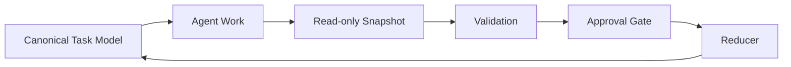

# Agent Work Snapshot

[日本語版 README](README.ja.md)

Agent Work Snapshot is a small, read-only checkpoint contract for AI agent work.
It helps coding agents and local automation report status, progress, blockers,
outputs, TTL, and completion candidates without collecting full transcripts.
When human collaborators and implementers join the same project, the same
contract can also be used to report their task-level work state without
mixing it into private chat logs or tool-specific histories.

At a higher level, it is a building block for project owners who need safe,
reviewable collaboration across multiple agents, terminals, machines, team
members, human implementers, and the AI agents those members operate. Instead
of tying control to one tool's private logs, every participant can publish the
same small checkpoint contract, so the owner can reconcile work as AI coding
tools and agent managers continue to evolve.

The package is intentionally small: a JSON Schema, a Python validator CLI, a
Markdown renderer, examples, tests, and documentation. It is not a full AI
orchestrator.



## Why Snapshots?

Agent conversations and tool logs are useful locally, but they are noisy,
provider-specific, and risky to aggregate. A snapshot contains only the small
work-state report a maintainer needs to review or reconcile progress.

`completed_candidate` is a report, not a command to close a parent task.
Validation, configured approval paths, and the system that owns canonical task
state still decide whether work is complete.

## Concept: WBS-driven Agent Control

WBS-driven Agent Control starts from a familiar project-management practice:
PMs and technical leads already use a WBS, issue tracker, or similar task model
to split work, assign owners, review progress, and approve completion. PMBOK,
ITSM, systems integration, web-service delivery, and internal software projects
may use different terminology, but the control pattern is familiar.

The idea is to apply that proven pattern to AI-assisted development. In this
context, an "agent" is not only an AI coding agent. It can be Codex, Claude
Code, Gemini CLI, a local automation job, a human collaborator, or a human
implementer. The manager still needs the same basic answer: which task is being
worked on, by whom or by what, how far it has progressed, what was produced,
and whether it is ready to approve.

Agent Work Snapshot is the smallest reporting contract for that model. A WBS,
issue tracker, project board, or another canonical task model remains the
source of truth. Agents and contributors export read-only checkpoints; external
validation, configured approval gates, and reducers decide whether canonical
task state changes.

This makes it useful as a neutral control-plane boundary for teams that run
more than one AI tool, more than one human-agent pair, or a mix of AI and human
contributors at the same time. The snapshot contract is meant to remain stable
even as the surrounding tools, agent managers, dashboards, and execution
environments change.

In other words, Agent Work Snapshot does not invent a brand-new management
discipline for the AI era. It extends the WBS-based control model that project
teams already know and trust to AI agents, automation, and human collaboration.

This repository implements the snapshot and validation boundary. It does not
implement a full AI orchestrator, approval service, reducer, or task database.

See [WBS-driven Agent Control](docs/wbs-driven-agent-control.md) for the
design model, safety boundaries, and a short comparison with PlanExe.

## Quick Start

Agent Work Snapshot requires Python 3.10 or newer.

```bash
git clone https://github.com/manabu619/agent-work-snapshot.git
cd agent-work-snapshot
python -m venv .venv
source .venv/bin/activate
# Windows PowerShell: .venv\Scripts\Activate.ps1
python -m pip install -e .
agent-work-snapshot --version
agent-work-snapshot validate examples/codex.snapshot.json
agent-work-snapshot render examples/codex.snapshot.json
```

To reject absolute local paths instead of reporting warnings:

```bash
agent-work-snapshot validate --strict-paths examples/codex.snapshot.json
```

## Example

```json
{
  "schema_version": "agent-work-snapshot/v1",
  "snapshot_id": "snap_example_0001",
  "agent_id": "example-coding-agent",
  "parent_task_id": "task_example_0001",
  "observed_at": "2026-01-01T00:00:00Z",
  "source": "local_file",
  "status": "working",
  "progress": {"total": 3, "completed": 1, "blocked": 0},
  "current_focus": "Add validation tests",
  "blockers": [],
  "outputs": ["tests/test_validation.py"],
  "next_checkpoint_at": "2026-01-01T01:00:00Z",
  "ttl_seconds": 3600
}
```

## Validation

The CLI combines two checks:

1. Draft 2020-12 JSON Schema validation with `date-time` format checking.
2. Small policy checks for recursive secret-like keys, relational progress
   constraints, and absolute local paths.

The validator is not a data-loss-prevention (DLP) tool. It cannot reliably
detect secrets or personal information embedded in free text. Run a separate
secret scan and human review before external transmission or publication.

Each finding starts with a stable category such as `[schema]` or
`[progress_relation]`. See [the contract reference](docs/contract.md) for the
category list.

## Schema Notes

- `host_id` is optional. Use only a pseudonymous identifier.
- `schema_version` must be `agent-work-snapshot/v1`.
- `source` is an extensible lowercase identifier such as `local_file`,
  `file_inbox`, `ci_artifact`, or `api_push`.
- `progress` contains integer `total`, `completed`, and `blocked` counts.
- `outputs` is an array of relative-path or artifact-reference strings.
- `completed_candidate` requires verification outside this package.
- Snapshots are append-only observations or reports. Do not merge them into
  canonical task state without an explicit reconciliation step.

See [the contract reference](docs/contract.md) and
[privacy model](docs/privacy-model.md).
For terminology, see the [glossary](docs/glossary.md).
For automation, see the [CI integration example](docs/ci-integration.md).
For rendering snapshots as Markdown, see the [Markdown handoff renderer](docs/markdown-handoff-renderer.md).
For validation coverage, see the
[schema conformance fixture matrix](docs/schema-conformance-fixtures.md).

## Examples

The repository includes provider-neutral examples for several execution
environments:

- `examples/codex.snapshot.json`
- `examples/claude-code.snapshot.json`
- `examples/gemini-cli.snapshot.json`
- `examples/local-llm.snapshot.json`

These files are examples of adapters producing the same contract. The package
does not integrate with or require any specific provider.

## Related Concepts

| Project or concept | Primary role | Relationship |
|---|---|---|
| [AGENTS.md](https://agents.md/) | Repository instructions and context for coding agents | Agent Work Snapshot reports small work-state checkpoints in the opposite direction |
| [Agent2Agent Protocol](https://github.com/a2aproject/A2A) | Communication and interoperability between agent systems | Agent Work Snapshot is a small state export, not an agent communication protocol |
| [OpenTelemetry](https://opentelemetry.io/) | Traces, metrics, and logs for software observability | Agent Work Snapshot reports task-level work state and completion candidates |

## Non-goals

- Building a full AI orchestrator
- Replacing project management tools
- Defining an agent-to-agent communication protocol
- Collecting full transcripts, prompts, or chain of thought
- Letting agents directly mutate canonical task state
- Shipping a database, REST API, dashboard, scheduler, or chat bot

## Development

```bash
python -m unittest discover -s tests -v
python scripts/validate_examples.py
python scripts/validate_fixtures.py
agent-work-snapshot render examples/codex.snapshot.json
```

## License

Apache License 2.0. See `LICENSE`.
