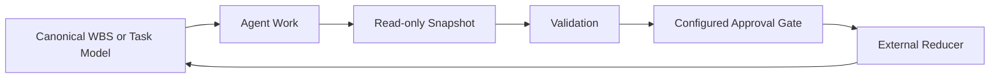

# WBS-driven AI Work Control

Agent Work Snapshot is the smallest contract in a broader design model:
**WBS-driven AI Work Control**.

The model is intentionally human-supervised. A WBS or another canonical task
model remains the source of truth. Agents do work and export read-only
snapshots, but they do not directly mutate canonical task state.

The goal is safe, accurate collaboration across multiple agents, terminals,
machines, team members, and the agents those members operate. As AI coding
tools and agent-management systems evolve, the stable part should be the
control boundary: a small checkpoint contract that lets the project owner
review, reconcile, and approve work without depending on any single tool's
private conversation log.

This repository implements the small snapshot and validation boundary. It does
not implement a complete control plane, approval service, reducer, database, or
AI orchestrator.

## Why Use a Canonical Task Model?

When several coding agents, local tools, or automation jobs contribute to a
project, work state can become scattered across transcripts and tool-specific
logs. Those sources are useful locally, but they are difficult to reconcile and
risky to aggregate.

This becomes more important when a project owner is coordinating work across
multiple devices or across several contributors, each with their own AI tools.
The checkpoint contract gives every participant the same reporting surface
without granting agents direct authority to mutate canonical task truth.

A canonical task model gives maintainers one place to decide:

- which task an agent is working on;
- what progress, blockers, and outputs have been reported;
- whether a checkpoint is still fresh;
- whether a completion report has passed verification;
- whether a human approval gate is required before a state transition.

The canonical model can be a WBS, an issue tracker, a project board, or another
task system. The important property is ownership: task truth is updated through
an explicit reconciliation path, not by accepting an agent report as a direct
mutation.

## The Small Contract

An Agent Work Snapshot is a short, provider-neutral JSON checkpoint. It can
report:

- status and progress counts;
- current focus;
- blockers;
- relative-path or artifact-reference outputs;
- an observation timestamp and TTL;
- a `completed_candidate` status when an agent believes work is ready for
  verification.

`completed_candidate` is not a command to close a parent task. It is a report
that an external verifier, configured approval path, and canonical-state owner
can evaluate.

The contract is read-only by design:

1. An agent exports a snapshot.
2. This package validates schema and small policy rules.
3. External systems decide whether additional verification or human approval
   is required.
4. An external reducer or state-transition handler may apply an approved event
   to the canonical task model.

## What This Repository Provides

The repository stays deliberately small:

- `agent-work-snapshot/v1` JSON Schema;
- Python validator CLI;
- provider-neutral examples;
- valid and invalid fixtures;
- small policy checks for secret-like keys, progress relations, and absolute
  local paths;
- documentation and CI.

The validator is not a data-loss-prevention tool. It cannot reliably detect
secrets or personal information embedded in free text. Use a separate secret
scan and human review before transmitting or publishing snapshots.

## What This Repository Does Not Provide

Agent Work Snapshot is not:

- a full AI orchestrator;
- a task database or project-management replacement;
- an approval workflow service;
- a reducer implementation;
- an agent-to-agent communication protocol;
- a dashboard, scheduler, dispatcher, or chat bot;
- a store for full transcripts, prompts, or chain of thought.

These components may exist in a larger system, but they are outside this
repository's current scope.

## Comparison with PlanExe

[PlanExe](https://github.com/PlanExeOrg/PlanExe) focuses on creating project
plans from goals. Its
[agent guide](https://github.com/PlanExeOrg/PlanExe/blob/main/docs/mcp/autonomous_agent_guide.md)
describes an autonomous workflow where an agent creates a plan, monitors
generation, retrieves the output, reads the generated WBS files, and can
execute work step by step against that plan.

PlanExe is a valuable open-source contribution to agent-assisted planning. Its
focus on turning goals into inspectable WBS artifacts gives developers a
practical way to make planning explicit instead of leaving it hidden inside an
agent transcript. This project references PlanExe with respect for that work
and for the maintainers making the workflow available to the community.

Agent Work Snapshot addresses a different boundary. It provides a small
contract for reporting work state back toward a canonical task model without
directly mutating task truth.

This comparison is not intended to frame the projects as competitors. They
address adjacent stages of a larger workflow and can be used together: PlanExe
can help create a plan and guide execution, while Agent Work Snapshot can
report small execution checkpoints toward a separately owned canonical task
model and its human-supervised reconciliation path.

| View | PlanExe | Agent Work Snapshot |
|---|---|---|
| Primary concern | Generate and consume project plans | Report read-only agent work checkpoints |
| Main direction | Goal to plan to execution | Agent work to snapshot to controlled reconciliation |
| WBS relationship | Produces WBS artifacts that agents can use while executing | Treats a WBS or canonical task model as externally owned task truth |
| Initial scope | Planning workflow and generated artifacts | Snapshot schema, validation, fixtures, examples, and docs |

As a short positioning summary:

- PlanExe is closer to a **planner/executor pattern**.
- Agent Work Snapshot is closer to a **control-plane/checkpoint pattern**.

These are explanatory summaries, not official PlanExe classifications. The two
approaches are complementary rather than competing: a plan may define tasks,
while snapshots report execution checkpoints back to the system that owns
canonical state.

## Safety Boundaries

Snapshots should contain only the minimum information needed for work-state
review. Do not include:

- secrets, tokens, credentials, or personal information;
- real host names or absolute local paths;
- full transcripts or prompt history;
- chain of thought;
- direct commands to close or mutate parent tasks.

Use pseudonymous identifiers where identification is useful. Keep outputs to
relative paths or artifact references. Treat snapshots as observations that
require reconciliation, not as trusted commands.

## Related Documents

- [Contract reference](contract.md)
- [Privacy model](privacy-model.md)
- [Migration and reconciliation](migration.md)
- [Glossary](glossary.md)
